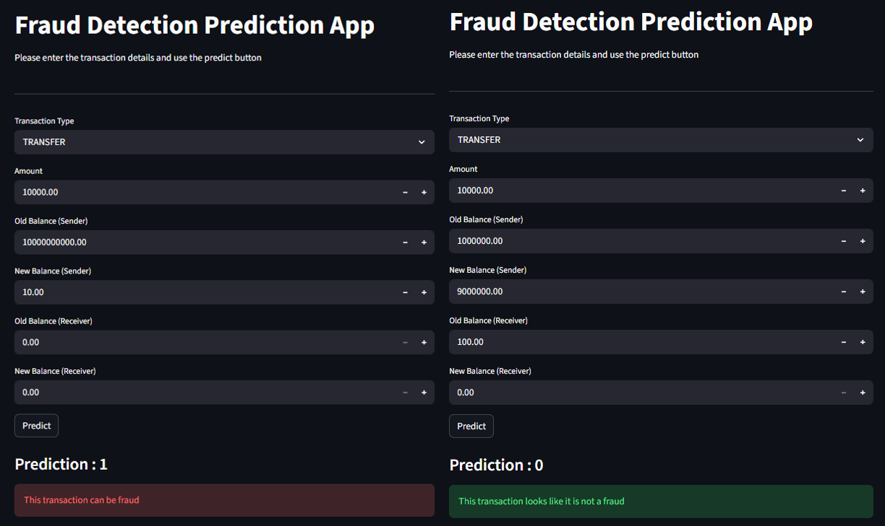

# 💳 Fraud Detection Machine Learning Project

---

## 1. Problem Statement

Financial fraud is a major challenge in digital transactions, leading to significant monetary losses. The goal of this project is to build a machine learning model that can accurately identify fraudulent transactions based on historical transaction data.

---

## 2. Dataset Description

The dataset contains simulated financial transaction records with features such as transaction type, amount, sender and receiver balances before and after the transaction.

### Key Features:
- `type` → Type of transaction (PAYMENT, TRANSFER, CASH_OUT, DEPOSIT)
- `amount` → Transaction amount
- `oldbalanceOrg`, `newbalanceOrig` → Sender's balance before and after transaction
- `oldbalanceDest`, `newbalanceDest` → Receiver's balance before and after transaction
- `isFraud` → Target variable (1 = Fraud, 0 = Not Fraud)

The dataset is highly imbalanced, with very few fraudulent transactions compared to normal ones.

---

## 3. Objective

- To analyze transaction patterns and identify fraud behavior  
- To build a robust machine learning model for fraud detection  
- To handle class imbalance effectively  
- To deploy the model for real-time prediction  

---

## 4. Proposed Solution

### 4a. Methodology

- Performed Exploratory Data Analysis (EDA) to understand transaction behavior  
- Identified that fraud is concentrated in **TRANSFER** and **CASH_OUT** transactions  
- Applied feature engineering:
  - Balance difference features (`balanceDiffOrig`, `balanceDiffDest`)
  - Detection of zero-balance anomalies  
- Handled class imbalance using `class_weight="balanced"`  
- Built a preprocessing pipeline using:
  - `StandardScaler` for numerical features  
  - `OneHotEncoder` for categorical features  
- Trained a **Logistic Regression model** within a pipeline  
- Saved the complete pipeline using `joblib`  
- Developed a **Streamlit web app** for real-time fraud prediction  

---

### 4b. Result / Evaluation Metrics

The model was evaluated using appropriate metrics for imbalanced data:

- Precision  
- Recall  
- F1-score  
- ROC-AUC Score  

📊 Model performance visualization:

---

## 5. Conclusion

This project demonstrates the development of an end-to-end fraud detection system using machine learning. Through data analysis and feature engineering, meaningful patterns were identified to improve model performance. A pipeline-based approach ensured efficient preprocessing and training, while deployment using Streamlit enabled real-time predictions. The project highlights the importance of handling imbalanced data and building practical, deployable ML solutions.

## 📂 Dataset

The dataset used in this project is large (~470 MB) and is not included in this repository.

👉 **Download Dataset from Google Drive:**  
[Click here to download](https://drive.google.com/file/d/1yciEExKmEs8fjmH3cb2MIQqYldMpj4w7/view?usp=sharing)
